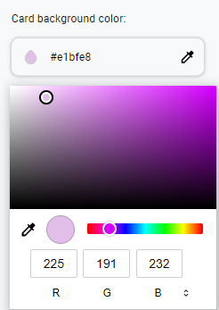
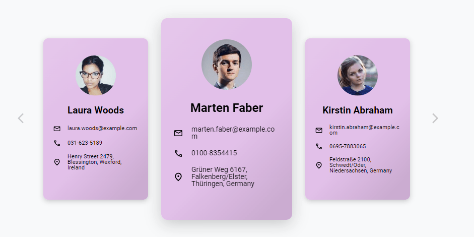

<div id="top"></div>
<!-- My Clerks solution -->


[![LinkedIn][linkedin-shield]][linkedin-url]

<!-- PROJECT -->
<div align="center">
  <h3 align="center">My Clerks</h3>
  <br/>
  
</div>

 &nbsp;
# My Clerks

<details>
    <summary>Table of Contents</summary>
    
  - [My Clerks](#my-clerks)
  - [Overview](#overview)
    - [Project structure](#project-structure)
    - [Built With](#built-with)
    - [Requirements](#requirements)
    - [Installation](#installation)
  - [Μain components](#ain-components)
    - [Modal](#modal)
    - [SelectColorBox](#selectcolorbox)
    - [UserSlider](#userslider)
    - [UserCard](#usercard)
  - [Fetching data logic](#fetching-data-logic)
  - [Αpplication style](#pplication-style)
  - [Testing](#testing)
  - [Contact](#contact)
  
 </details> 

 &nbsp;

## Overview

### Project structure
```sh
    .
    ├── public                  
    ├── src 
    │   ├── assets
    │   ├── components
    │   │   ├── modal                           # Modal component
    │   │   │   ├── Modal.jsx
    │   │   │   └── Modal.styles.jsx
    │   │   ├── spinner                         # Loading spinner component
    │   │   │   ├── Spinner.jsx
    │   │   │   └── Spinner.styles.jsx
    │   │   ├── select-color-box                # Card background color selection component
    │   │   │   ├── SelectColorBox.jsx
    │   │   │   ├── SelectColorBox.styles.jsx
    │   │   │   └── SelectColorBox.test.js
    │   │   ├── user-slider                     # Cards sliding carousel
    │   │   │   ├── UserSlider.jsx
    │   │   │   ├── UserSlider.styles.jsx
    │   │   │   └── UserSlider.test.js
    │   │   └── user-card                        # User card component
    │   │   │   ├── UserCard.jsx
    │   │   │   ├── UserCard.styles.jsx
    │   │   │   └── UserCard.test.js        
    │   ├── context                              # Selected color context provider
    │   │   └── color-context.jsx    
    │   ├── mocks                                # Server mocking
    │   │   ├── handlers.js
    │   │   ├── server.js
    │   │   └── userData.js
    │   ├── test-utils                          
    │   │   └── testing-library-utils.js         # Override testing library
    │   └── utils
    │       ├── styleVariables.js                # Shared style variables
    │       └── utils.js                         
    │   App.js
    │   App.test.js
    │   App.css
    │   index.js 
    │   index.css
    │   setupTests.js
    │   reportWebVitals.js
    └── README.md  
```


<p align="right">(<a href="#top">back to top</a>)</p>

### Built With
Main frameworks/libraries used to develop this project:
* [React](https://reactjs.org/)
* [Styled Components](https://styled-components.com/)

### Requirements
*  [Node.js](https://nodejs.org/en/)

### Installation
 
1.	Enter inside the project:
    ```sh
    cd my-clerks
    ```

2.	Install the dependencies
    ```sh
    npm i
    ```

<p align="right">(<a href="#top">back to top</a>)</p>

&nbsp;

## Μain components

### Modal
Messages modal with react portal structure, which when it displayed creates a blur effect in the background.

<p align="right">(<a href="#top">back to top</a>)</p>
&nbsp;

### SelectColorBox

Ιs the component with which the user selects cards background color. To display the color palette to the user, the browser's default ```<input type="color">``` was used. Τhe input element iteself is not displayed to user. 




<p align="right">(<a href="#top">back to top</a>)</p>
&nbsp;

### UserSlider

The element that contains the main program logic. It is responsible for displaying the users' cards and <a href="#fetching-logic">fetching cards data</a>. The user can change the card by clicking on the arrow button or by sliding touch (touch devices).


<p align="right">(<a href="#top">back to top</a>)</p>
&nbsp;

### UserCard

The user (profile) card component. It is child component of the  ```<UserSlider/>```
<p align="right">(<a href="#top">back to top</a>)</p>
&nbsp;

<div id="#fetching-logic"></div>

## Fetching data logic

Τhe application has 24 profiles stored at any time. Each call to the API returns 12 profiles. Depending on the direction (forward or backward) with which the user itarates through the cards, the previous data is divided in two and the needed one merges with the new data.

It is worth to mention that data fetching starts before the user reaches the last stored card. Ιn this way a smoother flow is ensured to the itaration (less spinners), also the user is not on the edge if he changes his itaration direction. A step by step explanation of the process follows:

1. User starts the app 
   
2. A ```useEffect``` hook fetches the first 24 profiles.
   
3. When the user reaches the 20th profile, a ```useEffect``` hook fetches the next 12 profiles. 
   
4. If the user reaches the 24th profile, the stored profile array is cut off and the second half (first half for backward movement) merges with the new fetched data.
   
5. The index of the stored profile array goes to the middle.

The backward itaration is done in a similar way.
<p align="right">(<a href="#top">back to top</a>)</p>
&nbsp;

## Αpplication style

Τhe app is designed for mobile first with minimum screen width of 300px. The strategy that has been followed for the media queries breakpoints is when the layout breaks. Αnimations were also added.

<p align="right">(<a href="#top">back to top</a>)</p>
&nbsp;

## Testing
Unit tests as well as and α mocking server were developed on the main elements of the application. 

1.	Enter inside the project:
    ```sh
    cd my-clerks
    ```

2.	Run testing script
    ```sh
    npm test


Τhe following libraries were used for testing the app:
* [Jest](https://jestjs.io/)
* [Testing Library](https://testing-library.com/)
* [Mock Service Worker](io)
<p align="right">(<a href="#top">back to top</a>)</p>
&nbsp;


## Contact

Dimos - Spiridon Dimou - [Linkedin](https://www.linkedin.com/in/spiridon-dimou-2aa98216b) - spirosdimou22@gmail.com

<p align="right">(<a href="#top">back to top</a>)</p>

[linkedin-shield]: https://img.shields.io/badge/-LinkedIn-black.svg?style=flat-square&logo=linkedin&colorB=555
[linkedin-url]: https://www.linkedin.com/in/spiridon-dimou-2aa98216b/